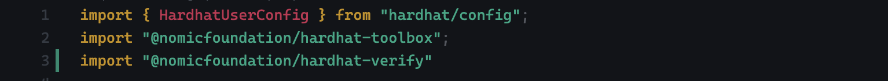

# Verify a Smart Contract deployed on Soneium

In this guide, we will learn how to verify a smart contract deployed on Minato, Soneium's testnet, using Hardhat. We'll use the smart contract that we deployed in the previous tutorial, in the [lesson-3 ↗](../lesson-3/). Let's get started!

## Verifying your contracts

Once your contract is ready, the next step is to deploy it to a live network and verify its source code.

Verifying a contract means making its source code public, along with the compiler settings you used, which allows anyone to compile it and compare the generated bytecode with the one that is deployed on-chain. Doing this is extremely important in an open platform like Ethereum.

In this guide I'll explain how to do this in the [Soneium explorer ↗](https://explorer-testnet.soneium.org/).

## 1. Install the plugin

The first thing we need is the ```hardhat-verify``` plugin, we can install it easily, just use this command inside your project: 

```bash
npm install --save-dev @nomicfoundation/hardhat-verify
```

## 2. Add plugin reference to your config file

Once installed, add the following statement at the top of your ```hardhat.config.ts```:

```typescript
import "@nomicfoundation/hardhat-verify";
```

It should look like this:



## 3. Config custom network to verify

Your ```hardhat.config.ts``` or ```hardhat.config.js``` will be setup to support the network you are working on, in our case, Minato. In order to use Blockscout explorer for the verification, you have to specify the explorer details under a ```customChains``` object. It includes:

- chainID - Network chain ID

- apiURL - Block explorer API URL

- browserURL - Block explorer URL

You can get a specific configuration for your project depending on your framework or tooling, I recommend you go to [Minato explorer ↗](https://explorer-testnet.soneium.org/) and go to ```⚙️ other``` section and select ```verify contract```.


Then, select the framework or tooling you're using, it will show you the specific settings for you. In our case, we have to select the Hardhat configuration:


Finally, this show us the specific configuration for Hardhat:


Now we can copy and paste this setting in our ```hardhat.config.ts``` file, it should look like this:

```typescript
import { HardhatUserConfig } from "hardhat/config";
import "@nomicfoundation/hardhat-toolbox";
import "@nomicfoundation/hardhat-verify"

const config: HardhatUserConfig = {
  solidity: "0.8.24",
  defaultNetwork: "minato",
  networks: {
    minato: {
      url: "https://rpc.minato.soneium.org/",
      chainId: 1946,
      accounts: ["your-private-key-here"]
    }
  },
  etherscan: {
    apiKey: {
      'minato': 'empty'
    },
    customChains: [
      {
        network: "minato",
        chainId: 1946,
        urls: {
          apiURL: "https://explorer-testnet.soneium.org/api",
          browserURL: "https://explorer-testnet.soneium.org"
        }
      }
    ]
  },
  sourcify: {
    enabled: false
  }
}

export default config;
```

## 4. Deploy and verify the smart contract

Now, we've configured everything and will be able to deploy and verify our contract. To do that, execute this command in your terminal:

```bash
npx hardhat ignition deploy ignition/modules/Rocket.ts --network minato
```

The output show you a smart contract address:


Copy this address and paste it into this command:

```bash
npx hardhat verify --network minato [smart-contract-address-here] [constructor-input-here]
```

For example, for the contract in this repository, the command could be:

```bash
npx hardhat verify --network minato 0x20CD9a2364bB244e3D72E84D0d5FdcE2448A0dD8 "carlos"
```

The output would be look like similar to this:


If you notice, the output is a link to the explorer with the contract, copy and paste the link into your browser and you'll see the verification.

## 5. Check the verification

Finally, you'll see the verification section and the source code. Now, your smart contract is 100% public and anyone on blockchain can verify it. Congratulations!


### Resources

[Blockscout documentation ↗](https://docs.blockscout.com/developer-support/smart-contract-verification/hardhat-verification-plugin).

[Hardhat documentation ↗](https://hardhat.org/hardhat-runner/docs/guides/verifying).